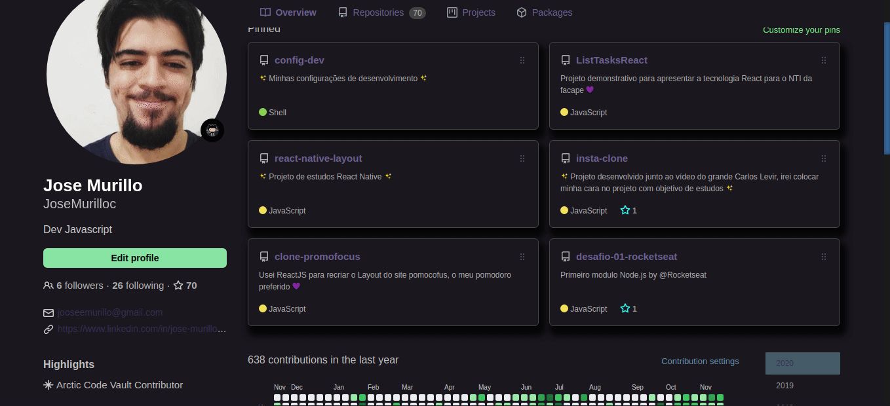

# Theme for Github based @Omni 💜

  <h2>Extension need Stylus (google chrome) &nbsp;</h2>
  <a href="https://chrome.google.com/webstore/detail/stylus/clngdbkpkpeebahjckkjfobafhncgmne">
  link to add extension
  </a>

## Examplo base 🎉

